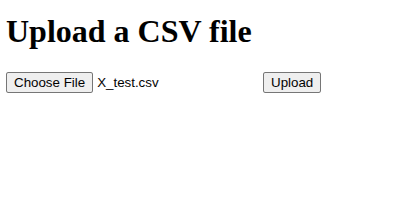
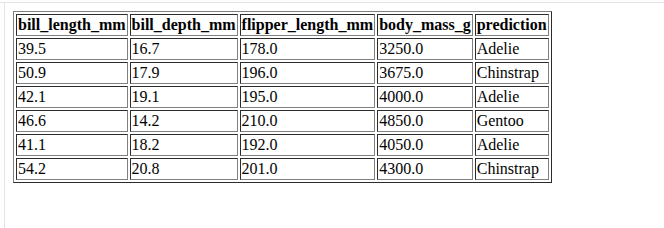

# machine-learning-microservice
My template for how to make a simple micro service for machine learning models. (in python)

Most likley you will want to change the predicted resturn to be json and not html. 
As well as chage the data to be sent in a json format. 
This is justa way of very easliy intract with the service and test it. 

## UI

